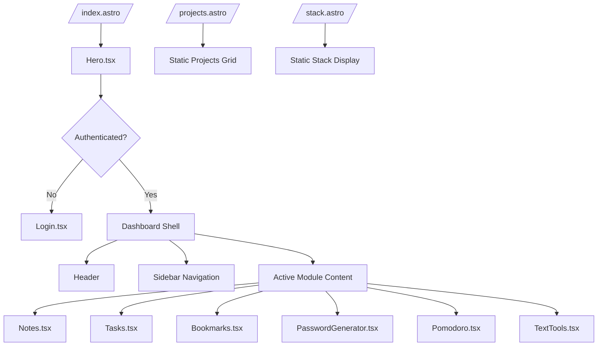
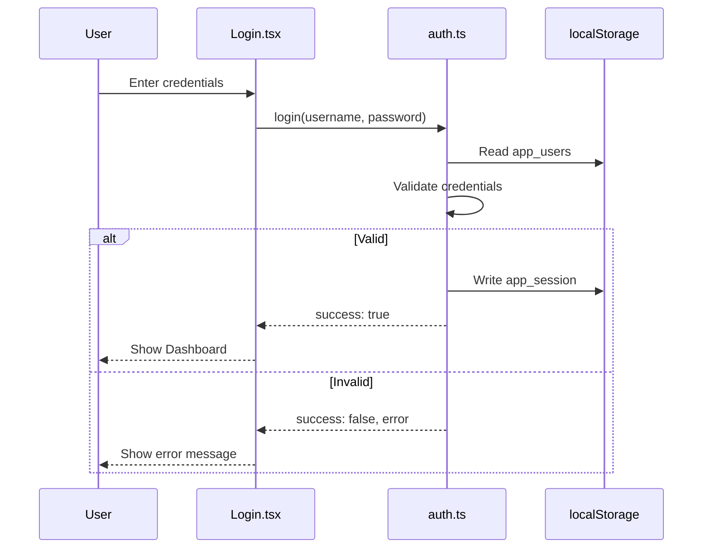

# cl1nical Dashboard - Project Analysis

## Overview

**cl1nical** (internally named "far-flare") is a personal productivity dashboard built with Astro 5, React 19, and Tailwind CSS 4. It provides a suite of client-side tools including notes, tasks, bookmarks, password generation, Pomodoro timer, and text utilities.

---

## Tech Stack

| Technology | Version | Purpose |
|------------|---------|---------|
| **Astro** | 5.17.1 | Static site generator & framework |
| **React** | 19.2.4 | Interactive UI components |
| **Tailwind CSS** | 4.2.1 | Styling framework |
| **TypeScript** | - | Type safety |
| **Lucide React** | 0.575.0 | Icon library |
| **Vite** | (via Astro) | Build tool & dev server |

---

## Project Structure

```
cl1nical-site/
├── public/
│   └── favicon.svg              # Site favicon
├── src/
│   ├── assets/                  # Static assets (SVGs, images)
│   ├── components/              # React components
│   │   ├── Hero.tsx             # Main dashboard shell (sidebar, header, module router)
│   │   ├── Login.tsx            # Authentication screen (login/register)
│   │   ├── Notes.tsx            # Note-taking module
│   │   ├── Tasks.tsx            # Todo/task management module
│   │   ├── Bookmarks.tsx        # Bookmark manager module
│   │   ├── PasswordGenerator.tsx # Password generation tool
│   │   ├── Pomodoro.tsx         # Focus timer (Pomodoro technique)
│   │   └── TextTools.tsx        # Text utilities (JSON, Base64, URL, Case)
│   ├── layouts/
│   │   └── Layout.astro         # Base HTML layout wrapper
│   ├── lib/
│   │   ├── api.ts               # API configuration (currently empty)
│   │   └── auth.ts              # Authentication utilities (localStorage-based)
│   ├── pages/
│   │   ├── index.astro          # Home page (renders Hero dashboard)
│   │   ├── projects.astro       # Projects showcase page (static)
│   │   └── stack.astro          # Tech stack display page (static)
│   └── styles/
│       └── global.css           # Tailwind imports
├── astro.config.mjs             # Astro configuration
├── tailwind.config.mjs          # Tailwind configuration
├── tsconfig.json                # TypeScript configuration
└── package.json                 # Dependencies
```

---

## Architecture

### Page Routing



### Data Flow

All data is stored **client-side** using `localStorage`:

| Module | Storage Key | Data Type |
|--------|-------------|-----------|
| Auth | `app_session` | Current user session |
| Auth | `app_users` | User credentials & roles |
| Notes | `app_notes` | Array of Note objects |
| Tasks | `app_tasks` | Array of Task objects |
| Bookmarks | `app_bookmarks` | Array of Bookmark objects |
| Theme | `app_theme` | `light` or `dark` |

### Authentication Flow



---

## Component Details

### Hero.tsx - Main Dashboard Shell
- **Role**: Central orchestrator component
- **Features**:
  - Authentication gate (shows Login if not authenticated)
  - Dark/light mode toggle with persistence
  - Responsive sidebar navigation (collapsible on mobile)
  - Module routing (switches between tools)
  - Header with user info, theme toggle, logout

### Login.tsx
- **Features**:
  - Login and Register modes
  - Password visibility toggle
  - Loading state animation
  - Demo credentials display
- **Default Admin**: `admin` / `admin123`

### Notes.tsx
- **Features**:
  - Create, edit, delete notes
  - Note list sidebar with search
  - Title and content editing
  - Timestamps for creation/updates

### Tasks.tsx
- **Features**:
  - Add tasks with priority (low/medium/high)
  - Category filtering (Work, Personal, Shopping, Health)
  - Task completion toggle
  - Progress statistics (total, completed, remaining, percentage)

### Bookmarks.tsx
- **Features**:
  - Add bookmarks with title, URL, category
  - Search functionality
  - Category filtering (Dev, Social, News, Tools, Other)
  - Grid layout with external link support

### PasswordGenerator.tsx
- **Features**:
  - Configurable length (8-64 characters)
  - Character type toggles (uppercase, lowercase, numbers, symbols)
  - Password strength indicator
  - Copy to clipboard

### Pomodoro.tsx
- **Features**:
  - Work timer (25 minutes)
  - Short break (5 minutes)
  - Long break (15 minutes) after 4 sessions
  - Circular progress indicator
  - Session tracking

### TextTools.tsx
- **Features**:
  - JSON format/minify
  - Base64 encode/decode
  - URL encode/decode
  - Case conversion (uppercase)
  - Copy output to clipboard

---

## Design System

### Dark Mode Colors
- Background: `#0a0a0a`
- Surface: `white/[0.03]` to `white/[0.08]`
- Borders: `white/[0.06]` to `white/[0.15]`
- Text: `white` (primary), `white/30` to `white/70` (secondary)
- Accent: Purple/Indigo gradients

### Light Mode Colors
- Background: `gray-50`
- Surface: `white`
- Borders: `gray-200`
- Text: `gray-900` (primary), `gray-400` to `gray-700` (secondary)
- Accent: Indigo (`indigo-50`, `indigo-100`, `indigo-700`)

---

## Current Limitations & Opportunities

### Limitations
1. **No backend**: All data is localStorage-bound (no sync across devices)
2. **No real API integration**: `api.ts` is empty
3. **Security**: Passwords stored in plaintext in localStorage
4. **No data export/import**: Cannot backup or migrate data
5. **Limited text tools**: Only 4 utilities, missing common ones

### Opportunities
1. **Cloud sync**: Add backend for cross-device data synchronization
2. **Data export/import**: JSON backup/restore functionality
3. **More tools**: Markdown editor, regex tester, color picker, etc.
4. **User preferences**: Customizable dashboard layout
5. **Keyboard shortcuts**: Power user features
6. **PWA support**: Install as desktop/mobile app
7. **Better auth**: Hash passwords, add OAuth providers
8. **Collaboration**: Shared notes/tasks for teams

---

## Commands

| Command | Description |
|---------|-------------|
| `npm run dev` | Start dev server at `localhost:4321` |
| `npm run build` | Build production site to `./dist/` |
| `npm run preview` | Preview production build locally |
| `npm run astro` | Run Astro CLI commands |

---

## Site URL

Configured as: `https://cl1nical.dev`
