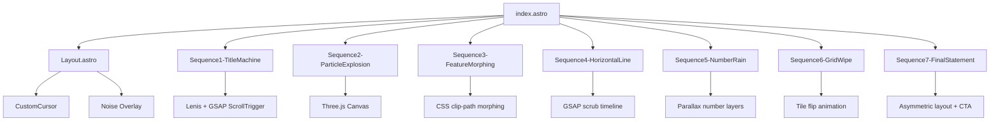

# Scroll-Driven Redesign Plan: "The Scroll IS the Content"

## Decisions
- ALL existing components will be replaced
- Raw Three.js for particles (not React Three Fiber)
- Sound toggle: SKIPPED for now

## Architecture Overview



## Current State Analysis

**Existing infrastructure we can leverage:**
- Lenis smooth scroll already installed and configured
- GSAP + ScrollTrigger already in use
- Three.js + @react-three/fiber already installed
- Custom cursor component exists (needs redesign to crosshair)
- Clash Display + DM Mono fonts already imported
- `prefers-reduced-motion` hook exists
- Global CSS custom properties for colors

**What needs to change:**
- All 8 existing section components will be replaced
- New 7 sequence components will be created
- Global CSS needs new color variables and animation classes
- Custom cursor needs crosshair redesign
- Lenis configuration needs tuning (lerp: 0.06)
- GSAP ScrollTrigger needs scrub: true on everything

## File Structure (New)

```
src/
├── pages/
│   └── index.astro                    # New: imports 7 sequences
├── layouts/
│   └── Layout.astro                   # Updated: new global elements
├── styles/
│   └── global.css                     # Updated: new design system CSS
├── hooks/
│   ├── useLenis.ts                    # Updated: new config
│   ├── useReducedMotion.ts            # Keep as-is
│   └── useScrollProgress.ts           # New: global scroll progress
├── components/
│   ├── effects/
│   │   ├── CustomCursor.tsx           # Redesigned: crosshair style
│   │   ├── ScrollProgressIndicator.tsx # New: vertical line right edge
│   │   └── SectionCounter.tsx         # New: "01 / 07" bottom right
│   └── sequences/
│       ├── Sequence1TitleMachine.tsx  # 200vh pin, text brand reveal
│       ├── Sequence2ParticleExplosion.tsx # 300vh pin, Three.js
│       ├── Sequence3FeatureMorphing.tsx   # 400vh pin, clip-path
│       ├── Sequence4HorizontalLine.tsx    # 200vh, timeline
│       ├── Sequence5NumberRain.tsx        # 150vh pin, falling stats
│       ├── Sequence6GridWipe.tsx          # 100vh, tile flip
│       └── Sequence7FinalStatement.tsx    # 200vh pin, CTA
```

## Phase-by-Phase Implementation

### Phase 1: Foundation

**Files to modify:**
- `src/hooks/useLenis.ts` — Update config: `lerp: 0.06`, remove duration-based easing
- `src/styles/global.css` — New color variables, new animation classes, update cursor styles
- `src/layouts/Layout.astro` — Add ScrollProgressIndicator and SectionCounter

**New CSS custom properties:**
```css
:root {
  --bg-dark: #0a0a0a;
  --bg-cream: #F5F0E8;
  --accent-amber: #E8A020;
  --accent-blue: #2D5BE3;
  --text-cream: #F5F0E8;
}
```

**New global elements in Layout:**
- Scroll progress: 1px vertical line, right edge, fills top-to-bottom
- Section counter: "01 / 07" DM Mono 10px, bottom right

### Phase 2: Sequence 1 — Title Machine (200vh pin)

**Component:** `src/components/sequences/Sequence1TitleMachine.tsx`

**Structure:**
- Container: 200vh, pinned
- Single text element: "cl1nical"
- Background element that transitions #0a0a0a → #F5F0E8

**GSAP Timeline (scrub: 1.5):**
```
0%:   fontSize: 2vw, letterSpacing: 0.5em, opacity: 0.2, color: white
50%:  fontSize: 20vw, letterSpacing: 0.1em, opacity: 0, color: matches bg
100%: fontSize: 40vw, letterSpacing: -0.05em, opacity: 1, color: dark
```

**Key detail:** At 50% scroll, text color matches background color — text disappears for one moment. This is the brand reveal.

### Phase 3: Sequence 2 — Particle Explosion (300vh pin)

**Component:** `src/components/sequences/Sequence2ParticleExplosion.tsx`

**Structure:**
- Full-screen Three.js canvas
- 2000 particles as a BufferGeometry with Points
- Background: cream #F5F0E8

**Three phases mapped to scroll (scrub: 1.5):**
- **Phase 1 (0-33%):** Grid → random explosion positions
- **Phase 2 (33-66%):** Random → "FOCUS" dot-matrix formation
- **Phase 3 (66-100%):** "FOCUS" → implode to single point, expand

**Implementation approach:**
- Pre-calculate 3 position arrays: grid positions, random positions, "FOCUS" letter positions
- Use GSAP to interpolate between position sets based on scroll progress
- Use `uniforms` for particle size and color transitions

### Phase 4: Sequence 3 — Feature Morphing (400vh pin)

**Component:** `src/components/sequences/Sequence3FeatureMorphing.tsx`

**Structure:**
- Dark background
- Single large shape center screen
- Text inside shape, number below

**4 states mapped to scroll:**
```
State 1 (0vh):    circle(50%)        "TASKS"  white    "01"
State 2 (100vh):  inset(0%)          "SAVED"  amber    "02"
State 3 (200vh):  polygon(triangle)  "SECURE" blue     "03"
State 4 (300vh):  circle(50%) large  "DONE"   white    "04"
```

**Implementation:**
- CSS `clip-path` animated via GSAP scrub
- Text crossfades between states using opacity
- Color transitions via GSAP on backgroundColor
- Shape size transitions via GSAP on width/height

### Phase 5: Sequence 4 — Horizontal Line Travel (200vh)

**Component:** `src/components/sequences/Sequence4HorizontalLine.tsx`

**Structure:**
- Cream background
- 1px horizontal line, full width, vertical center
- 4 labels on the line: "TASKS" "BOOKMARKS" "PASSWORDS" "FOCUS"
- Moving dot mapped to scroll position

**Implementation:**
- Line: 1px div, full width
- Labels: positioned at 20%, 40%, 60%, 80% of line width
- Dot: GSAP scrub maps scroll to `left` position (0% → 100%)
- Label pulse: GSAP `scale(1.2)` when dot reaches each label
- Label reveal: `clip-path: inset(100% 0 0 0)` → `inset(0 0 0 0)` on scroll

### Phase 6: Sequence 5 — Number Rain (150vh pin)

**Component:** `src/components/sequences/Sequence5NumberRain.tsx`

**Structure:**
- Dark background
- 60+ number elements falling at different speeds
- Stats: "10,847" "0" "∞" "256" "99.9" "0ms"

**Implementation:**
- Each number is a span with absolute positioning
- GSAP timeline scrubs `top` from `-10vh` to `110vh`
- Different speeds per number (parallax layers)
- At 100%: all numbers cleared except one "0" centered at 80vw
- "0" shrinks, "$" slides in, together "$0" fades out

### Phase 7: Sequence 6 — Grid Wipe (100vh)

**Component:** `src/components/sequences/Sequence6GridWipe.tsx`

**Structure:**
- 8x8 grid of squares (64 total)
- Initially cream (invisible on cream bg)
- Scroll drives wave pattern flip from top-left to bottom-right
- When all dark: squares fade, background is now dark

**Implementation:**
- CSS Grid: 8x8, gap between squares
- Each square: div with background color
- GSAP timeline: stagger from index 0 to 63
- Each square: `backgroundColor: cream` → `backgroundColor: dark`
- After all flipped: grid opacity → 0

### Phase 8: Sequence 7 — Final Statement (200vh pin)

**Component:** `src/components/sequences/Sequence7FinalStatement.tsx`

**Structure:**
- Dark background
- 3 words: "LESS" "IS" "MORE"
- Asymmetric layout:
  - "LESS" — top left, 15vw
  - "IS" — middle, 20vw
  - "MORE" — bottom right, 30vw

**Scroll-driven reveals:**
- Word 1: slides from left (0-33%)
- Word 2: slides from right (33-66%)
- Word 3: rises from bottom (66-100%)

**After all visible:**
- 0.5s pause
- "LESS" and "IS" fade out
- "MORE" drifts to center
- "MORE" transforms into CTA button

### Phase 9: Global Interaction Layer

**Custom Cursor Redesign:**
- Crosshair style: 1px lines, 16px
- 45deg rotation on hover
- `mix-blend-mode: difference`
- Always visible (no dot + ring, just crosshair)

**Scroll Progress Indicator:**
- 1px vertical line, right edge of screen
- Full height
- Fills from top as user scrolls
- Color matches current section accent

**Section Counter:**
- "01 / 07" DM Mono 10px
- Bottom right
- Updates with scroll position

### Phase 10: Performance & Accessibility

**Performance:**
- `will-change: transform` on all animated elements
- GSAP `ScrollTrigger.refresh()` on resize
- Three.js particle cleanup on unmount
- Lenis `destroy()` on unmount

**Accessibility:**
- `prefers-reduced-motion`: show final states only
- All text still readable by screen readers
- Semantic HTML structure maintained
- Keyboard navigation for CTA button

## Build Order (Strict)

1. **Foundation** — Lenis config, global CSS, Layout updates
2. **Sequence 1** — Title Machine (test scrub feel)
3. **Sequence 3** — Feature Morphing (test scrub feel)
4. **Sequence 4** — Horizontal Line (simplest, quick win)
5. **Sequence 6** — Grid Wipe (transition between sections)
6. **Sequence 7** — Final Statement (CTA)
7. **Sequence 5** — Number Rain (parallax complexity)
8. **Sequence 2** — Particle Explosion (most complex, last)
9. **Global Layer** — Cursor, progress indicator, counter
10. **Performance Pass** — will-change, cleanup, reduced-motion

## Tuning Guidelines

If scroll feels disconnected from animation:
- Reduce Lenis `lerp` to `0.06`
- Increase ScrollTrigger `scrub` to `2`

Test scrub feel after EVERY sequence.
